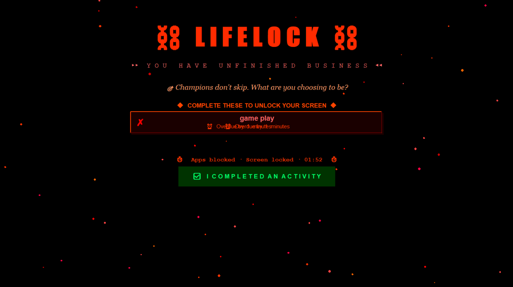

# 🔒 LifeLock — Habit Enforcer App

A Python desktop application that **forces you to complete your daily habits** by taking over your entire screen when you miss an activity.

## 🚨 What it does
- Monitors your daily activity schedule automatically
- Triggers a **fullscreen lockdown** when activities are overdue
- Kills distracting apps (Chrome, Spotify, Discord, Steam)
- Screen **cannot be closed** until activity is marked complete
- Rotating emotional guilt messages to motivate you
- Alarm sound + desktop notifications

## 📸 Screenshot

## 🛠️ Tech Stack
- **Python** — core application logic
- **tkinter** — animated GUI with fullscreen lockdown
- **psutil** — OS-level process management to kill apps
- **threading** — background monitoring every 30 seconds
- **plyer** — desktop push notifications
- **winsound** — alarm sounds
- **JSON** — persistent data storage

## ⚙️ How to Run

### Install dependencies
pip install plyer psutil

### Run the app
python lifelock.py

## 💡 Features
- ✅ Add daily activities with custom times
- ✅ Mark activities as done
- ✅ Automatic background checker every 30 seconds
- ✅ Fullscreen lockdown — Alt+F4 and Escape disabled
- ✅ Kills Chrome, Spotify, Discord automatically
- ✅ Animated particles, typewriter effects, 3D blocks
- ✅ Saves activities permanently to file

## 🎯 Built to solve
Phone addiction and procrastination — LifeLock makes skipping your habits more frustrating than doing them.

## 👨‍💻 Built by
Krishna Kumar Singh
- 📧 kishansingh20907@gmail.com
- 🔗 [LinkedIn](https://linkedin.com/in/krishnakumarsingh)
- 🌐 [Portfolio](https://flat-apartment-rent.vercel.app)